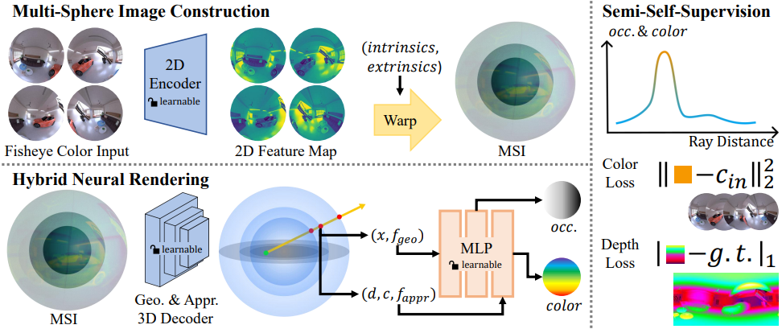

# MSI-NeRF
Linking Omni-Depth with View Synthesis through Multi-Sphere Image aided Generalizable Neural Radiance Field

### [Paper](https://arxiv.org/abs/2403.10840) | [Video](https://www.youtube.com/watch?v=UmtEM4Uj5b0)

> MSI-NeRF <br />
> Dongyu Yan, Guanyu Huang, Fengyu Quan and Haoyao Chen <br />
> WACV 2025

<p align="center">
  
</p>

This repository contains code for the paper MSI-NeRF: Linking Omni-Depth with View Synthesis through Multi-Sphere Image aided Generalizable Neural Radiance Field..

## Install

```sh
conda env create -f environment.yml
conda activate msinerf
```

## Usage

### Train

```sh
python train.py --config ./config/default.txt --gpus 4 --batch_size 1 --split_ratio 0.95 --max_epoch 30
```

### Test

1. Run depth map generation (along with color map generation in rig center)

```sh
python test.py --config ./config/default.txt --gpus 1 --batch_size 1 --ckpts_epoch 29 --split_ratio 0.95
```

1. Run color map generation in NVS dataset

```sh
python test.py --config ./config/default.txt --gpus 1 --batch_size 1 --ckpts_epoch 29 --eval_nvs
```

3. Run novel view synthesis using predefined trajectory

```sh
python test.py --config ./config/default.txt --gpus 1 --batch_size 1 --ckpts_epoch 29 --traj_type 0 --render_novel_view --eval_nvs (optional)
```
